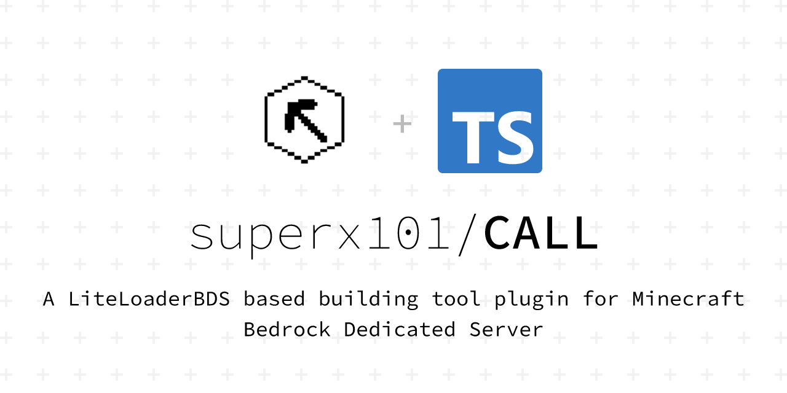
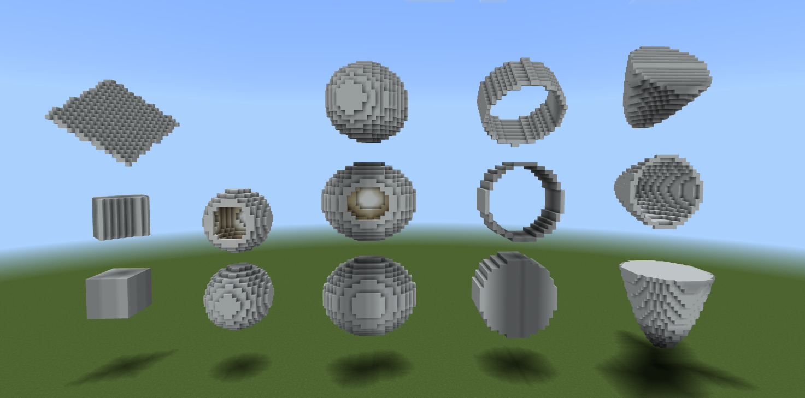

# Introduction to plug-ins

English | [简体中文](./docs/user/introduction.md)

## Introduction
Construct Assistant for LiteLoaderBDS, abbreviated as CALL, is an auxiliary construction tool for BDS, and provides API to support other plug-in developers to expand the functions of CALL.

**Why CALL?**
- ___Command operation___  
All operations in CALL support commands, so you can use the command box to perform a CALL operation for a player, for example: `/execute @p ~ ~ ~/call menu`

- ___User experience___  
CALL is committed to improving the user experience, and all basic operations can be completed by **GUI** clicking (**Graphical interface**) without excessive learning costs. For instructions, this plug-in provides default values and **Simplified instruction**, for example, instructions: `/call area start ~ ~ ~` can be simplified to `/ca ar a` you can also bind instructions to,**Shortcut key**one-click execution, more convenient

- ___Multi-person collaboration___   
Structures you can save with other players**Share**

- ___Cross archive___  
Copied, saved structures can be **Cross archive** used

- ___Custom permissions___  
Backstage administrator **Customize** : Which players can use CALL?

- ___Wide range___  
CALL uses a thread-wait approach to avoid the situation where the operation fails because the chunk is not loaded. In theory, a single region of that CALL may B
   
- ___Third-party support___  
CALL allows other developers to write plug-ins that extend functionality, which you can install **Third-party plug-ins** to get **More functions**

- ___Open source and free___  
This plugin uses the GPL-3.0 protocol, full **Open source and free** project address: Bug <https://github.com/superx101/CALL> _(It's my time to program a BDS plug-in, Please forgive if there are any mistakes)_ Feedback and Suggestions: [691552572](https://jq.qq.com/?_wv=1027&k=9soqRZuV)

- ___Automatic update___  
Automatic download, automatic installation, and automatic reloading of plug-ins Since version 1.0.0, CALL can enable automatic updates in the configuration, or enter background commands for semi-automatic `call update` updates.

- ___Documentation Tutorial___  
CALL provides you [document](https://superx101.github.io/CALL/) with a detailed record of plug-in installation, usage, and third-party plug-in development tutorials.

## Function
- **Selection fill**  
- **The selection is cleared**  
- **Selection replacement**  
- **Selection translation**  
- **Selection stacking**  
- **Selection mirroring**  
- **Selection rotation**  
- **Undo**  
- **Redo**  
- **Copy**  
- **Paste**  
- **Save the structure**  
- **Load Save**  
- **Delete and save**  
- **Share and save**  
- **Shortcut key**  
- **Generate a shape**

## Shape
The shapes of the current version are as follows:
