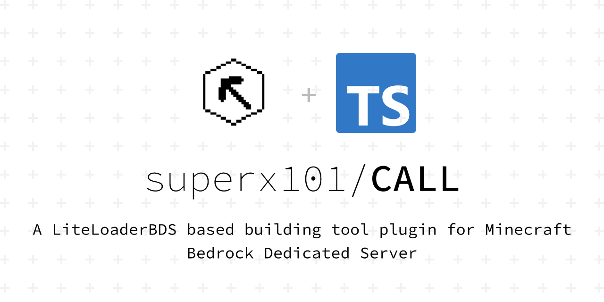

# 插件介绍
## 简介
&emsp;&emsp;Construct Assistant for LiteLoaderBDS, 简称CALL、建造助手，是针对**基岩版服务器（BDS）**的辅助建造工具，且提供API支持其他插件开发者拓展CALL的功能。

**为什么选择CALL？**  
- ___指令操作___  
&emsp;CALL中所有操作均支持指令，因此您可以使用命令方块为某一玩家执行CALL操作，例:  
&emsp;&emsp;`/execute @p ~ ~ ~ /call menu`

- ___用户体验___  
&emsp;CALL致力于提升用户体验，所有基础操作均可使用**GUI**(**图形化界面**)点击完成，不需要过多学习成本。  
&emsp;对于指令，本插件提供了缺省值和**简化版指令**,
例如指令:`/call area start ~ ~ ~`可简化为`/ca ar a`  
&emsp;您也可以将指令绑定到**快捷键**，一键执行，更加方便

- ___多人协作___  
&emsp;您可与其他玩家**共享**保存的结构

- ___跨存档___  
&emsp;复制、保存的结构可**跨存档**使用

- ___自定义权限___  
&emsp;后台管理员可**自定义**哪些玩家可以使用CALL

- ___大范围___  
&emsp;CALL使用了一种线程等待方式来避免因区块未加载而操作失败的情况。理论上CALL单个区域可**操作范围**为 **64000 * 320 * 64000**
   
- ___第三方支持___  
&emsp;CALL支持其他开发者编写拓展功能的插件，您可安装**第三方插件**来获取**更多的功能**  

- ___开源免费___  
&emsp;本插件使用MIT协议，完全**开源免费**  
&emsp;项目地址：<https://github.com/superx101/CALL> _(首次编写BDS插件，大佬轻喷)_  
&emsp;Bug反馈与建议：[691552572](https://jq.qq.com/?_wv=1027&k=9soqRZuV)

- ___自动更新___  
&emsp;自动下载、自动安装、自动重载插件  
&emsp;自1.0.0版本后CALL可在配置中开启自动更新，或输入后台指令`call update`半自动更新

- ___文档教程___   
&emsp;CALL为您提供了[文档](https://superx101.github.io/CALL/)，记录了较为详细的插件安装、使用方法以及第三方插件开发教程

## 功能
- **[选区填充](user/function/areaOperation?id=%e5%a1%ab%e5%85%85-fill)**
- **[选区清除](user/function/areaOperation?id=%e6%b8%85%e9%99%a4-clear)**
- **[选区替换](user/function/areaOperation?id=%e6%9b%bf%e6%8d%a2-replace)**
- **[选区平移](user/function/areaOperation?id=%e5%b9%b3%e7%a7%bb-move)**
- **[选区堆叠](user/function/areaOperation?id=%e5%a0%86%e5%8f%a0-stack)**
- **[选区镜像](user/function/areaOperation?id=%e9%95%9c%e5%83%8f-mirror)**
- **[选区旋转](user/function/areaOperation?id=%e6%97%8b%e8%bd%ac-rote)**
- **[撤销](user/function/other?id=%e6%92%a4%e9%94%80-undo)**
- **[恢复](user/function/other?id=%e6%81%a2%e5%a4%8d-redo)**
- **[复制](user/function/other?id=%e5%a4%8d%e5%88%b6-copy)**
- **[粘贴](user/function/other?id=%e7%b2%98%e8%b4%b4-paste)**
- **[保存结构](user/function/other?id=%e4%bf%9d%e5%ad%98-save)**
- **[加载保存](user/function/other?id=%e5%8a%a0%e8%bd%bd%e7%bb%93%e6%9e%84-load)**
- **[删除保存](user/function/other?id=%e5%88%a0%e9%99%a4%e7%bb%93%e6%9e%84-delete)**
- **[共享保存](user/function/other?id=%e7%bb%93%e6%9e%84%e5%85%ac%e5%bc%80-public)**
- **[快捷键](user/function/hotkey)**
- **[生成形状](user/function/shape)**

## 形状
当前版本中自带的形状如下：
